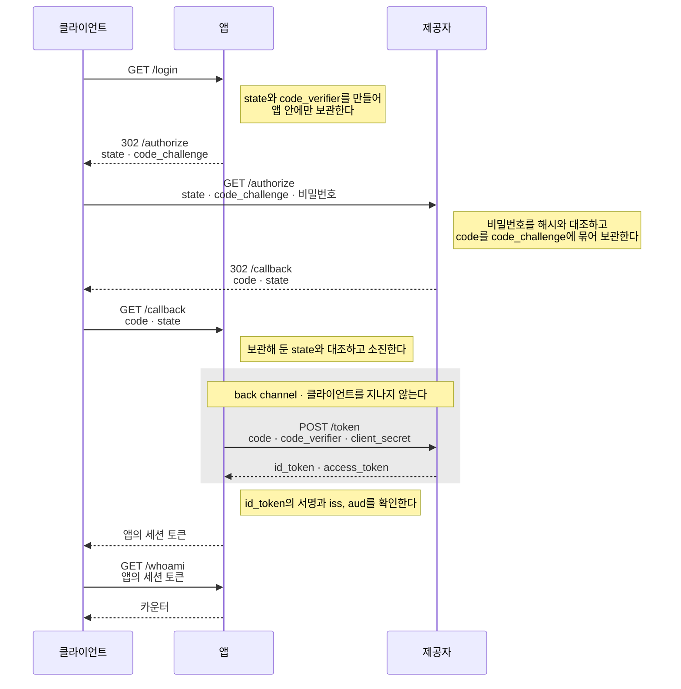

# OAuth 2.0 / OIDC

비밀번호를 한 번도 건네받지 않는 서버다.
신원 확인을 외부 제공자에게 맡기고, 그쪽이 서명해 준 결과만 받아서 자기 세션을 시작한다.

두 서비스가 함께 올라간다. `:18080`이 우리 앱이고 `:19090`이 인증 제공자다.
한 프로세스에서 함께 돌지만 서로 독립된 서비스이며, 실제로는 각각 배포된다.

## 실행

```bash
go run .
```

## 확인할 것

```bash
# 앱은 아무것도 묻지 않고 제공자로 보낸다
AUTH=$(curl -s -i localhost:18080/login | awk '/^[Ll]ocation:/{print $2}' | tr -d '\r')
echo $AUTH
# http://localhost:19090/authorize?client_id=til-authentication&code_challenge=yyAg-...&
#   code_challenge_method=S256&redirect_uri=http%3A%2F%2Flocalhost%3A18080%2Fcallback&
#   response_type=code&scope=openid&state=CKRIAU3CPKDGJ3PNSCW4D66WIT

# 비밀번호는 제공자에게만 간다. ($AUTH 내의 주소가 :19090)
CB=$(curl -s -i -u alice:wonderland "$AUTH" | awk '/^[Ll]ocation:/{print $2}' | tr -d '\r')
echo $CB
# http://localhost:18080/callback?code=RBB7CIMLX7BL3ALQPCFSTWJUEQ&state=CKRIAU3CPKDGJ3PNSCW4D66WIT

# 앱이 code를 토큰으로 바꾸고 자기 세션 토큰을 발급한다
SESSION=$(curl -s "$CB") && echo $SESSION
# eyJhbGciOiJIUzI1NiIsInR5cCI6IkpXVCJ9.eyJzdWIiOiJhbGljZSIsImV4cCI6MTc4ODA5MDQzM30.clSBmn-...

curl -H "Authorization: Bearer $SESSION" localhost:18080/whoami   # alice: 1
curl -H "Authorization: Bearer $SESSION" localhost:18080/whoami   # alice: 2
```

앱에 비밀번호를 보내 볼 수는 있지만 받아 줄 곳이 없다.

```bash
curl -u alice:wonderland localhost:18080/whoami   # missing token
grep -c 'bcrypt' app.go                           # 0
```

브라우저를 거치는 것은 `code`뿐이고, 그것만으로는 토큰을 받을 수 없다.
앱이 교환하기 전에 redirect에서 `code`를 가로챈 상황을 만들어 본다.

```bash
# 새 흐름을 열되, 이번에는 callback을 부르지 않는다
AUTH2=$(curl -s -i localhost:18080/login | awk '/^[Ll]ocation:/{print $2}' | tr -d '\r')
CB2=$(curl -s -i -u alice:wonderland "$AUTH2" | awk '/^[Ll]ocation:/{print $2}' | tr -d '\r')
CODE=$(echo $CB2 | sed 's/.*code=\([^&]*\).*/\1/')

curl -X POST localhost:19090/token \
  -d grant_type=authorization_code -d code=$CODE \
  -d client_id=til-authentication -d client_secret=client-secret-shared-with-the-provider \
  -d redirect_uri=http://localhost:18080/callback \
  -d code_verifier=GUESS
# invalid code_verifier
```

`code_verifier`는 앱의 메모리에만 있다가 앱과 제공자 사이에서 직접 오간다.
`code`를 가로챈 쪽은 그 값을 알 수 없으므로 교환에 실패한다. 이것이 PKCE(Proof Key for Code Exchange)다.

## 흐름



회색으로 묶인 구간만 클라이언트를 지나지 않는다.
`code_verifier`와 `client_secret`은 그 구간의 화살표에만 나타나고, 비밀번호는 제공자로 가는 화살표에만 나타난다.

그래서 나머지 화살표에 실린 값을 모두 손에 넣어도 토큰 교환은 되지 않는다.
`code_challenge`는 `code_verifier`의 SHA-256 해시라서 그 값에서 원래 값을 되돌릴 수도 없다.

### 오가는 값

앱은 사용자를 제공자로 보냈다가, 제공자가 앱의 `/callback` 주소로 되돌려보내는 것을 받는다.
이 왕복에서 각 값이 하나씩 맡은 일이 있다.

| 값 | 만드는 쪽 | 하는 일 |
|---|---|---|
| `state` | 앱 | 사용자를 제공자로 보낼 때 붙이는 표식이다. `/callback`으로 들어온 요청에 같은 값이 실려 있어야 앱이 시작한 로그인으로 인정한다 |
| `code_verifier` | 앱 | 앱이 토큰을 받을 때 제공자에게 내밀어야 하는 값이다. 앱 밖으로 나가지 않으므로 앱만 알고 있다 |
| `code_challenge` | 앱 | `code_verifier`를 해시한 값이다. 앱이 미리 보내 두면, 제공자는 이 해시와 맞는 원본을 내미는 쪽에만 토큰을 준다 |
| `code` | 제공자 | 토큰과 바꿀 수 있는 1회용 교환권이다. 토큰 자체를 사용자에게 돌려보내지 않으려고 대신 보낸다 |
| `client_secret` | 사전 등록 | 토큰을 요청한 쪽이 제공자에 등록해 둔 그 앱임을 증명한다 |
| `id_token` | 제공자 | 방금 로그인한 사용자가 누구인지 앱에게 알려 준다 |

`code`가 따로 있는 이유는 제공자가 사용자를 되돌려보낼 때 브라우저의 주소창을 거치기 때문이다.
주소창에 실린 값은 방문 기록과 `Referer` 헤더, 중간 서버의 접근 로그에 그대로 남는다.
오래 쓰는 토큰을 그런 곳에 남길 수는 없으므로, 수명이 짧고 한 번만 쓰이는 `code`를 대신 보낸다.

`code_challenge`와 `code_verifier`는 그 `code`마저 누군가 가로챘을 때를 대비한다.
앱은 로그인을 시작할 때 해시만 내보내고 원본은 자기 메모리에 남겨 둔다.
토큰을 받으려면 원본을 내밀어야 하므로, `code`만 손에 넣은 쪽은 아무것도 얻지 못한다.

`client_secret`이 있는데도 이 절차가 필요한 것은 secret을 숨길 수 없는 앱이 있기 때문이다.
모바일 앱이나 SPA는 코드가 사용자 기기에 내려가므로 포함시켜 둔 secret을 꺼내 볼 수 있다.
`code_verifier`는 로그인할 때마다 새로 만들고 버리는 값이라 미리 포함시켜 둘 것이 없다.
OAuth 2.1 초안은 앱의 종류를 가리지 않고 이 절차를 요구한다.

## 문제상황

앱이 만들어 내보내는 `state`와 로그인 끝에 발급하는 세션 토큰, 이 두 값을 사용자의 브라우저에
저장해 두었다가 다시 돌려받을 방법을 지금까지 정하지 않았다. 여기서 두 가지 문제가 발생한다.

### `/callback`을 부른 쪽이 누구인지 확인하지 못한다

공격자가 자기 계정으로 로그인을 진행해 `code`와 `state`를 얻은 다음, 그 주소를 피해자에게 열게 한다.

```bash
# 공격자(bob)가 자기 로그인을 callback 직전까지 진행한다
AUTH3=$(curl -s -i localhost:18080/login | awk '/^[Ll]ocation:/{print $2}' | tr -d '\r')
ATT=$(curl -s -i -u bob:builder "$AUTH3" | awk '/^[Ll]ocation:/{print $2}' | tr -d '\r')

# 피해자(alice)가 이 주소를 연다
SESSION=$(curl -s "$ATT")
echo $SESSION | cut -d. -f2 | d64
# {"sub":"bob","exp":1788095444}
```

alice의 브라우저에 bob의 세션이 자리를 잡았다.
이 상태에서 alice가 무엇을 저장하든 bob의 계정에 쌓이고, bob은 자기 계정으로 로그인해 그것을 들여다볼 수 있다.

앱은 `state`를 자기 맵에만 담아 두므로 이 `state`로 시작된 로그인이 있었다는 것까지만 확인한다.
그 로그인을 시작한 브라우저와 지금 `/callback`을 부른 브라우저가 같은지는 확인하지 못한다.

RFC 6749 §10.12는 이 대비를 MUST로 규정한다.

> The client MUST implement CSRF protection for its redirection URI. This is typically accomplished by
> requiring any request sent to the redirection URI endpoint to include a value that **binds the request
> to the user-agent's authenticated state** (e.g., a hash of the session cookie used to authenticate the
> user-agent).

지금 `state`는 URL이라는 한 경로로만 오간다. 앱이 `/authorize` 주소에 `state`를 실어 보내면
제공자가 그 값을 그대로 `/callback` 주소에 담아 돌려준다. 그래서 앱이 `/callback`에서 받는 `state`는
누가 그 주소를 열었든 똑같은 값이고, 공격자가 미리 만들어 둔 주소를 피해자가 열어도 앱은 차이를 발견하지 못한다.

앱이 두 브라우저를 구별하려면, 같은 `state`가 서로 다른 두 경로로 앱에 도착해야 한다.
하나는 지금처럼 URL에 실려 오는 경로이고, 다른 하나는 로그인을 시작할 때 그 브라우저에 저장해 두었다가
브라우저가 `/callback` 요청에 스스로 실어 보내는 경로다. 앱은 `/callback`에서 두 값이 일치하는지 확인한다.

두 번째 경로는 로그인을 시작한 브라우저에만 만들어진다. 공격자가 자기 브라우저에 `state`를 저장해 두더라도,
정작 `/callback` 주소를 여는 것은 피해자의 브라우저이므로 그 값은 앱까지 따라오지 못한다.

```
GET /callback?state=ABC123        <- 공격자가 만들어 건넨 URL에 실려 온 값
브라우저가 실어 보낸 값: 없음       <- 피해자의 브라우저는 이 `state`를 저장한 적이 없다
```

두 값이 어긋나므로 앱은 이 요청을 거절한다.
다만 `state`를 브라우저에 저장시켰다가 돌려받을 수단이 지금 앱에는 없어서, 이 대조를 아직 구현하지 못한다.

### 발급한 세션 토큰을 보관할 곳이 없다

지금까지 네 챕터가 증거를 무엇으로 할지 정해 왔다. 비밀번호에서 세션 ID로, 서명한 토큰으로,
그리고 남이 서명해 준 결과로 바뀌었다. 그런데 클라이언트가 그것을 어디에 보관하는지는
`curl` 명령의 셸 변수에 담아 두는 것으로 넘어왔다.

브라우저에서는 사정이 다르다. `Authorization: Bearer` 헤더를 붙이는 주체가 페이지의 JavaScript이므로,
헤더를 만들려면 JavaScript가 토큰 값을 읽을 수 있어야 하고, 그러려면 `localStorage`나 변수처럼
JavaScript가 읽을 수 있는 곳에 두게 된다. 같은 곳을 페이지에 끼어든 스크립트도 읽을 수 있다.

`state`와 세션 토큰을 사용자의 브라우저에 저장시켜 두고 서버가 그 값을 돌려받는 수단이 있으면
두 문제가 함께 해결된다.

## 짚어둘 것

- **`id_token`이 이것을 인증으로 만든다.** `access_token`은 소지자가 무엇을 할 수 있는지를 말하고,
  `id_token`은 사용자가 누구인지를 말한다. 앞의 것만 받아서 신원으로 삼는 것이 OAuth 2.0을 인증에 잘못 쓰는
  대표적인 방식이며, OIDC가 뒤의 것을 표준으로 규정한 이유다.
- **`id_token`의 서명뿐 아니라 `iss`와 `aud`도 확인한다.** 서명이 맞다는 것은 위조가 아니라는 뜻일 뿐이다.
  누가 발급했고 누구에게 준 것인지 확인하지 않으면, 다른 앱에 발급된 토큰을 그대로 가져와 쓸 수 있다.
- **`redirect_uri`는 제공자에 미리 등록해 둔 값과 대조한다.** 이 검사가 없으면 공격자가 자기 주소를 적어
  `code`를 그쪽으로 배달시킬 수 있다.
- **`code`는 한 번만 쓰이고 수명이 짧다.** 브라우저를 거쳐 가는 유일한 값이라서 그렇다. 앱과 제공자 사이의
  교환은 서로 직접 연결해서 하므로 `client_secret`과 `code_verifier`는 브라우저를 지나가지 않는다.
- **redirect URL을 먼저 가로챈 쪽은 막지 못한다.** 위의 대조가 통하는 것은 요청을 보내는 쪽이 피해자의
  브라우저일 때뿐이다. 공격자가 피해자의 `code`와 `state`를 가로채 자기 손으로 요청을 보내는 경우라면,
  그 요청에 붙일 값도 자기가 정하므로 훔친 `state`와 같은 값을 넣어 보내면 두 값이 일치한다.
  이쪽은 TLS로 URL을 감추고 `code`의 수명을 짧게 두어 가로챌 틈을 줄이는 것으로 대응한다.
- **위임한 것은 비밀번호 검증뿐이다.** 앱은 여전히 자기 세션 토큰을 발급하고 자기 secret으로 서명한다.
  제공자가 알려 준 것은 지금 이 사람이 alice라는 사실 하나이며, 그 뒤의 수명 관리는 앱의 몫이다.
